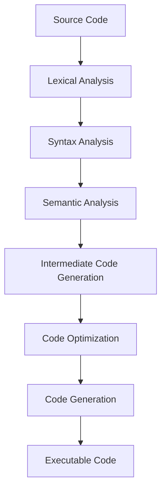
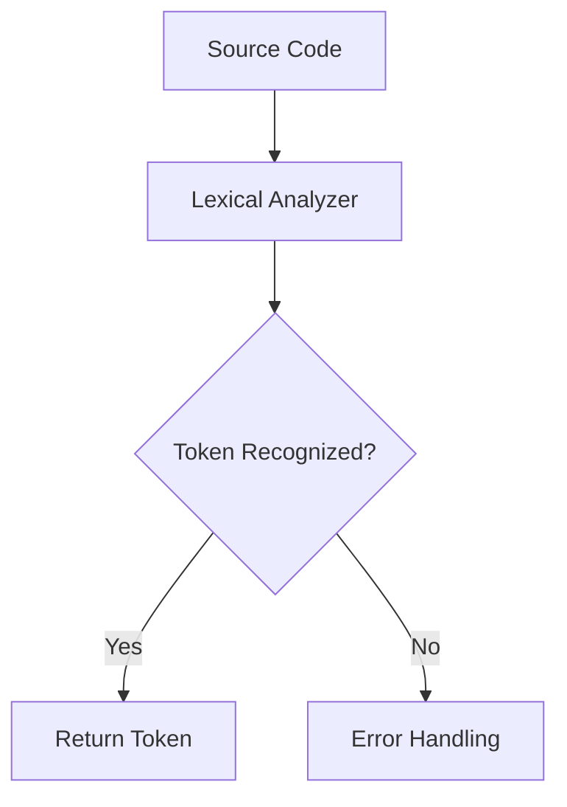
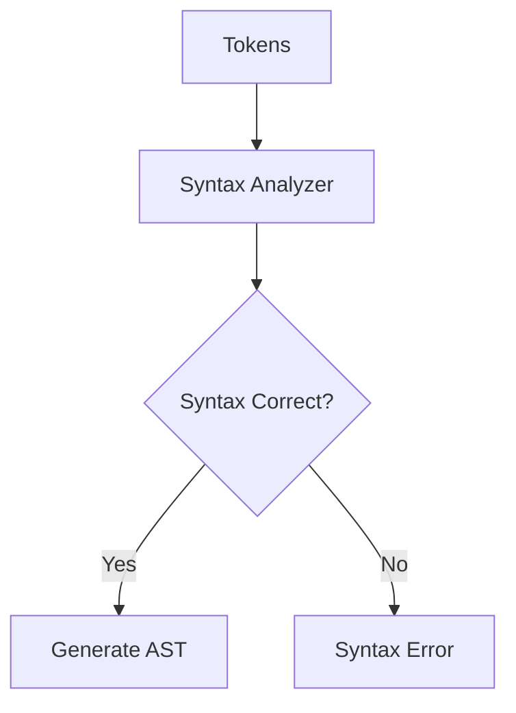
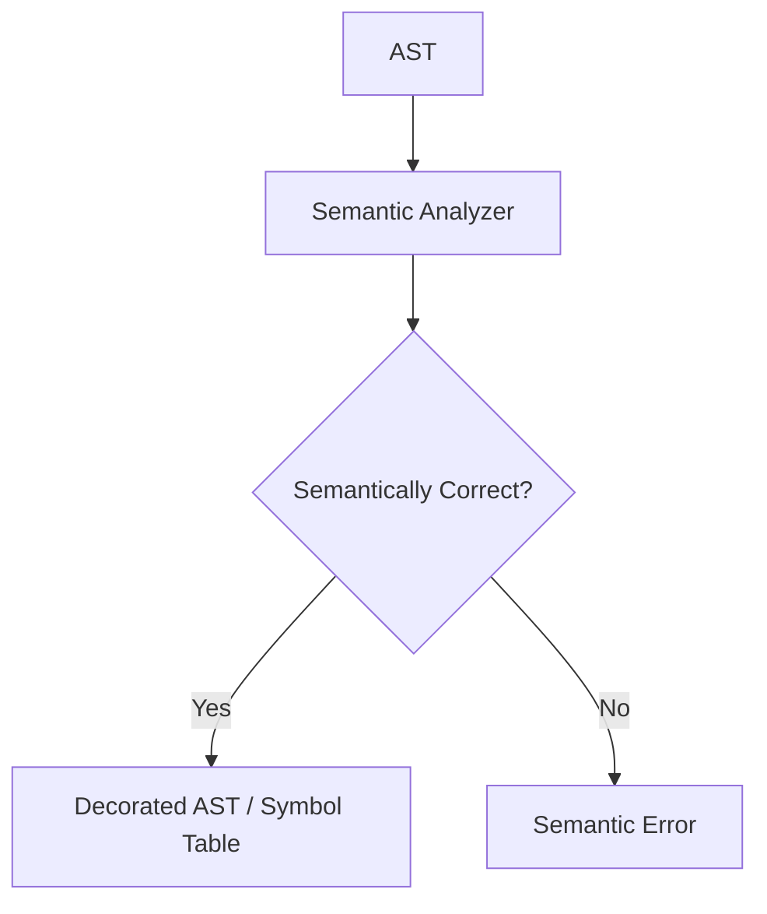

پروژه کامپایلر مهدی اکبرپور, عرفان باقی و سهند احمدی

[DOCUMENT & HOW TO RUN](docs/README.md)
---

# طراحی کامپایلر – مقاله

کامپایلر (Compiler) برنامه‌ای است که کد منبع (Source Code) نوشته شده توسط برنامه‌نویس را به کد ماشین (Machine Code) یا یک زبان میانی (Intermediate Code) تبدیل می‌کند تا قابل اجرا توسط سیستم باشد. طراحی کامپایلر شامل چندین مرحله و اجزا است که هر یک وظایف خاص خود را دارند.

---

## ساختار و اجزای کامپایلر

یک کامپایلر معمولاً از دو بخش اصلی تشکیل شده است: Front-End و Back-End.

1. Front-End

   * وظیفه آن بررسی صحت Syntax و Semantics برنامه است.
   * اجزای اصلی:

     * Lexical Analyzer (Lexer / Scanner): ورودی برنامه را به Tokens تقسیم می‌کند.
     * Syntax Analyzer (Parser): Tokens را به یک Parse Tree یا Abstract Syntax Tree (AST) تبدیل می‌کند.
     * Semantic Analyzer: بررسی می‌کند که کد از نظر معنایی درست باشد و Type Checking را انجام می‌دهد.

2. Back-End

   * وظیفه آن تولید کد هدف و بهینه‌سازی است.
   * اجزای اصلی:

     * Intermediate Code Generator: تولید یک کد میانی مستقل از ماشین.
     * Optimizer: بهینه‌سازی کد میانی برای افزایش کارایی.
     * Code Generator: تولید کد ماشین یا زبان هدف.

3. Symbol Table

   * ساختاری برای نگهداری اطلاعات مربوط به شناسه‌ها (Identifiers) مانند نام، نوع (Type) و موقعیت در حافظه.

---

## فلو کلی کامپایل شدن

---

## جریان کار تحلیلگرها

### 1. Lexical Analyzer

* ورودی: Source Code
* خروجی: Tokens
* وظیفه: حذف فاصله‌ها و کامنت‌ها، تشخیص کلمات کلیدی (Keywords)، شناسه‌ها (Identifiers) و عملگرها (Operators).

### 2. Syntax Analyzer

* ورودی: Tokens
* خروجی: Parse Tree / AST
* وظیفه: بررسی Syntax Rules و تولید ساختار درختی برنامه.

### 3. Semantic Analyzer

* ورودی: AST
* خروجی: Decorated AST / Symbol Table
* وظیفه: بررسی معنایی برنامه مانند Type Checking و اطمینان از درست بودن استفاده از متغیرها و توابع.

---

## جمع‌بندی

کامپایلرها ابزارهای کلیدی در توسعه نرم‌افزار هستند که با استفاده از چندین مرحله تحلیلی و تولید کد، برنامه‌های سطح بالا را به کد قابل اجرا تبدیل می‌کنند. فهم Front-End و Back-End و جریان کار تحلیلگرها (Lexical, Syntax, Semantic Analyzers) برای طراحی و توسعه کامپایلر ضروری است.

---